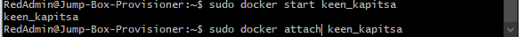
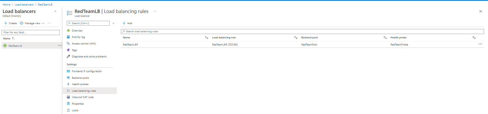

# This document contains the following details:
- Overview for setting up DVWA Container
- Automated ELK Stack Deployment

## Overview for setting up DVWA Container

The files in this repository were used to configure the network depicted below.

These files have been tested and used to generate a live DVWA deployment on Azure. They can be used to either recreate the entire deployment pictured above. 

This section contains the following details:
- Setup of network above
- Deplaymen of DVWA
- Test redundancy systems

### Description of the Topology
The main purpose of this network is to expose a load-balanced and monitored instance of DVWA, the D*mn Vulnerable Web Application.

The configuration details of each machine may be found below.

| Name       | Function             | Local IP Address | Operating System |
|------------|----------------------|------------------|------------------|
| Jump Box   | Gateway              | 10.0.0.4         | Linux            |
| Web-1      | DVWA Virtual Machine | 10.0.0.5         | Linux            |
| Web-2      | DVWA Virtual Machine | 10.0.0.6         | Linux            |
| Web-3      | DVWA Virtual Machine | 10.0.0.8         | Linux            |

### Access Policies
The machines on the internal network are not exposed to the public Internet. 

Only the jump box machine can accept connections from the Internet. Access to this machine is only allowed from the following IP addresses:
- User Public IP

Machines within the network can only be accessed by the jump box machine.
- 52.250.119.203.

A summary of the access policies in place can be found in the table below.

| Name       | Publicly Accessible | Allowed IP Addresses |
|------------|---------------------|----------------------|
| Jump Box   | No                  | User Public IP       |
| Web-1      | No                  | 52.250.119.203       |
| Web-2      | No                  | 52.250.119.203       |
| Web-3      | No                  | 52.250.119.203       |

### DVWA Configuration
Ansible was used to automate configuration of the DVWA machine. No configuration was performed manually, which is advantageous because it improves reliability, consistency, and speed of deployment through the use of infrastructure as code.

The playbook implements the following tasks:
- Install Docker.io
- Install python3-pip
- Install Docker python module
- Download and launch a docker web container
- Enable docker service

The following screenshot displays the result of successfully configuring the DVWA instance.

The following screenshot displays the result of successfully deployment of the DVWA instance.

### Target Machines

We have installed the following DVWA on these machines:
- Web-1 10.0.0.5
- Web-2 10.0.0.6
- Web-3 10.0.0.8

# Walkthrough process of setting up DVWA
To do this part. You must have a Microsoft Azure account. 

### Create a resource group
Search resource group in the search bar.

Create a new resource group.

### Set up virtual network 
Search virtual network in the search bar.

Create a new virtual network.

Input the follwing settings:

### Create a network security group
Search network security group in the search bar.

Create a new network security group.

Input the follwing settings:

### Obtain SSH Key from client machine
From terminal use the following commands:
- ssh-keygen
- cat ~/.ssh/id_rsa.pub
Save the output for later.

### Create a Jump Box
Search virtual machine in the search bar.

Create a new network security group.

Input the follwing settings and copy the SSH key above to the SSH Public Key field:

### Create Web VMs for the DVWA machines
Search virtual machine in the search bar.

Create a new network security group.

Input the follwing settings, and do not set a public IP.
Input the SSH key above for now, this will be updated later.

Repeat these steps to create web-1, web-2, and web-3.

### Create network security group rule to allow access to jumpbox
Search network security group in the search bar.

Create a network security group for the virtual network.

Create rule to allow Clinet IP access to jump box.

### Create network security group rule to allow jumpbox access to the network
Search network security group in the search bar.

Create rule to allow jumpbox access to the network.

### SSH into Jump Box

SSH into the jumpbox with the following IP and commands:

Check user priviliages.

### Set up Ansible containers on the Jump Box
Update apts on jumpbox

install docker.io

Check docker status

Start docker if it is not started

Pull ansible

In root, rul ansible

### Set up provisioners from the Ansible container
Check list of containers in the jumpbox

Start the Ansible container and run it.

Obtain SSH key from the Ansible container

From Azure, go to your Web-1 virtual network, select reset password, and update it with the SSH key from the Ansible container.
The user name for Web-1, Web-2, and Web-3 must be the same.

Ping the IP of Web-1 from the Ansible container to verify that its working.

SSH into Web-1 to verify that its working.

Get into ansible host file using the command: nano /etc/ansible/hosts
Add the following lines in the host file

Ping the local IPs to verify that it is working.

Change the Ansible configuration file by using the command nano /etc/ansible/ansible.cfg and uncomment remote_user line and replace root with sysadmin (or your choosen user name).
The configuration file can be found in 

### Set up Ansible Playbooks
Lauch the Ansible container from the Jump Box

Create a playbook in /etc/ansible called pentest.ylm. A copy of the .ylm file can be found in .

Run the pentest.ylm playbook

SSH into Web-1 and rule the curl command to verify that it is working.

### Create load balancing
Search load balancer in the search bar.

Create a new load balancer.

Select the following settings.

Create a Health Probe with the follwoing settings.

Create a backend pool and add the virtual machines to the pool.

Create a load balancing rule with the following settings.

### Create network security rules to allow access to port 80
Search network security group in the search bar.

Create rule to allow port 80 access from clinet public IP.

Verify that DVWA app can be reached by typing http://[LoadBalancer_Public_IP]/setup.php

### Check and verify that load balancer is working

Verify that DVWA app can be reached by typing http://[LoadBalancer_Public_IP]/setup.php

In Azure, stop web-1.

Verify that DVWA app can still be reached by typing http://[LoadBalancer_Public_IP]/setup.php

# If DVWA app can reached by typing http://[LoadBalancer_Public_IP]/setup.php, the deployment is complete.

## Automated ELK Stack Deployment

The files in this repository were used to configure the network depicted below.

These files have been tested and used to generate a live ELK deployment on Azure. They can be used to either recreate the entire deployment pictured above. Alternatively, select portions of the filebeat-playbook.yml file may be used to install only certain pieces of it, such as Filebeat.

This document contains the following details:
- Description of the Topology
- Access Policies
- ELK Configuration
  - Beats in Use
  - Machines Being Monitored
- How to Use the Ansible Build

A walkthrough of ELK, Filebeat, and Metricbeat setup can be found in:

### Description of the Topology

The main purpose of this network is to expose a load-balanced and monitored instance of DVWA, the D*mn Vulnerable Web Application.

Load balancing ensures that the application will be highly fault tolerant, in addition to restricting access to the network.
- Load balancers ensure system availability when a one or more components within the system fail or are overloaded by distributing the load load to redundant components.
- A jump box is a secure admin workstation used as an origination point to connect to other servers in a network for administrative tasks, and used to prevent all the servers in the network from being exposed to the public.

Integrating an ELK server allows users to easily monitor the vulnerable VMs for changes to the log data and system metrics.
- Filebeat monitors the log files of servers, collects log events, and forwards them to Elasticsearch or Logstash for indexing.
- Metricbeat records metrics and statistics from an operation system and from services running on servers, and forwards them to Elasticsearch or Logstash

The configuration details of each machine may be found below.

| Name       | Function             | Local IP Address | Operating System |
|------------|----------------------|------------------|------------------|
| Jump Box   | Gateway              | 10.0.0.4         | Linux            |
| Web-1      | DVWA Virtual Machine | 10.0.0.5         | Linux            |
| Web-2      | DVWA Virtual Machine | 10.0.0.6         | Linux            |
| Web-3      | DVWA Virtual Machine | 10.0.0.8         | Linux            |
| ELK-SERVER | ELK Stack            | 10.1.0.4         | Linux            |

### Access Policies

The machines on the internal network are not exposed to the public Internet. 

Only the jump box machine can accept connections from the Internet. Access to this machine is only allowed from the following IP addresses:
- User Public IP

Machines within the network can only be accessed by the jump box machine.
- Only the jump box machine can access the ELK-SERVER from 52.250.119.203.

A summary of the access policies in place can be found in the table below.

| Name       | Publicly Accessible | Allowed IP Addresses |
|------------|---------------------|----------------------|
| Jump Box   | No                  | User Public IP       |
| Web-1      | No                  | 52.250.119.203       |
| Web-2      | No                  | 52.250.119.203       |
| Web-3      | No                  | 52.250.119.203       |
| ELK-SERVER | No                  | 52.250.119.203       |

### Elk Configuration

Ansible was used to automate configuration of the ELK machine. No configuration was performed manually, which is advantageous because it improves reliability, consistency, and speed of deployment through the use of infrastructure as code.
- The main advantage of automating configuration with Ansible is the improvement in speed and reduction of human error.

The playbook implements the following tasks:
- Install Docker.io
- Install python3-pip
- Install Docker python module
- Increase available memory by setting vn.max_map_count to 262144
- Download and launch docker elk container
- Enable service docker on boot

The following screenshot displays the result of running `docker ps` after successfully configuring the ELK instance.

### Target Machines & Beats
This ELK server is configured to monitor the following machines:
- 10.0.0.5
- 10.0.0.6
- 10.0.0.8

We have installed the following Beats on these machines:
- Web-1 10.0.0.5
- Web-2 10.0.0.6
- Web-3 10.0.0.8

These Beats allow us to collect the following information from each machine:
- Filebeat collects log events, which we can provide information about network traffic, usage and other conditions in systems.
- Metricbeat collects metrics on systems and services, which can be used to monitor CPU and memory usage, network traffic, and other metrics in the systems and services.

### Using the Playbook
In order to use the playbook, you will need to have an Ansible control node already configured. Assuming you have such a control node provisioned: 

SSH into the control node and follow the steps below:
- Copy the ELK configuration file to the file directory.
- Update the host file to include the IP address of ELK server and python 3.
- Run the playbook, and navigate to http://ELK-SERVER_public_IP]:5601/app/kibana to check that the installation worked as expected.

Installing ELK from Ansible
- Modify the host file from /etc/hosts to include : [elk]
- Modify the host file from /etc/hosts to include: [ELK-SERVER_local_IP] ansible_python_interpreter=/usr/bin/python3 below [elk]
- Copy the install-elk.yml file to /etc/ansible
- Copy the file ansible.cfg to /etc/ansible/files
- Run the install-elk.yml playbook
- Check that the installation worked by navigating to http://ELK-SERVER_public_IP]:5601/app/kibana
- The following screenshot will display if Kibana successfully launches 
- If there are issues accessing the kibana page above, check Network Security Group Inbound rules on Azure.

Installing Filebeat on the DVWA Container with Ansible
- Make sure the kibana page above is accessible
- Copy the filebeat-playbook.yml file to /etc/ansible
- Copy the file filebeat-config.yml to /etc/ansible/files
- Run the filebeat-playbook.yml playbook
- Check on Kibana that logs are being received

Installing Metricbeat on the DVWA Container with Ansible
- Make sure the kibana page above is accessible
- Copy the metricbeat-playbook.yml file to /etc/ansible
- Copy the file metricbeat-config.yml to /etc/ansible/files
- Run the metricbeat-playbook.yml playbook
- Check on Kibana that logs are being received

ELK, Filebeat, and Metricbeat configuration files location

# Walkthrough process of setting up ELK
To do this part. You must have a Microsoft Azure account. 

### Set up virtual network 
Search virtual network in the search bar.

Create a new virtual network with the following settings.

### Create a Peer connection between the virtual networks.
Select the ELK-net created in the last step and select peering.

### Obtain container SSH key
SSH into Jump Box
Check list of containers in the jumpbox

Start the Ansible container and run it.

Obtain SSH key from the Ansible container

### Create an ELK-VM
Search virtual machine in the search bar.

Create a new virtual machine.

Input the follwing settings and copy the SSH key above to the SSH Public Key field:
Give the virtual machine a static public IP address.

SSH into the virtual machine to verify that its working.

### Set up provisioners from the Ansible container
Get into ansible host file using the command: nano /etc/ansible/hosts
Add the following lines in the host file

Ping the local IPs to verify that it is working.

Run the  playbook.

SSH into the ELK-Server VM and check ELK-Server VM sudo docker ps

### Create network security rules to allow access
Search network security group in the search bar.

Create rule to allow port 22 access from jump box.

Create rule to allow port 80 and port 5601 access from clinet public IP.

Verify that Kibana app can be reached by typing http://[ELK-SERVER]:5601/app/kibana

# Setting up FileBeats

In the Kibana app navigate to Home/Add data/ System Logs for set up infomation.

### Set up Ansible Playbooks
Lauch the Ansible container from the Jump Box

Copy the filebeat configuration file to /etc/ansible/files
The filebeat configuration file can be obtained by:

https://gist.githubusercontent.com/slape/5cc350109583af6cbe577bbcc0710c93/raw/eca603b72586fbe148c11f9c87bf96a63cb25760/Filebeat

Open the filebeat configuration file and replace the following inforamation:
- Line 1106 : Replace IP address with local IP address of ELK machine.
- Line 1806 : Replace IP address with local IP address of ELK machine.

Create a playbook in /etc/ansible called filebeat-playbook.yml. A copy of the .ylm file can be found in .

Run the filebeat-config.ylm playbook.

Verfy the logs are bring received from the module status in the Kibana app.
In the Kibana app navigate to Home/Add data/ System Logs.

# Setting up Metricbeat

In the Kibana app navigate to Home/Add data/ System metrics for set up infomation.

### Set up Ansible Playbooks
Lauch the Ansible container from the Jump Box

Copy the Metricbeat configuration file to /etc/ansible/files
The Metricbeatconfiguration file can be obtained by:

https://gist.githubusercontent.com/slape/58541585cc1886d2e26cd8be557ce04c/raw/0ce2c7e744c54513616966affb5e9d96f5e12f73/metricbeat

Open the filebeat configuration file and replace the following inforamation:

- Line 1106 : Replace IP address with local IP address of ELK machine.
- Line 1806 : Replace IP address with local IP address of ELK machine.

Create a playbook in /etc/ansible called filebeat-playbook.yml. A copy of the .ylm file can be found in .

Run the filebeat-config.ylm playbook.

Verfy the logs are bring received from the module status in the Kibana app.
In the Kibana app navigate to Home/Add data/ System Logs.

